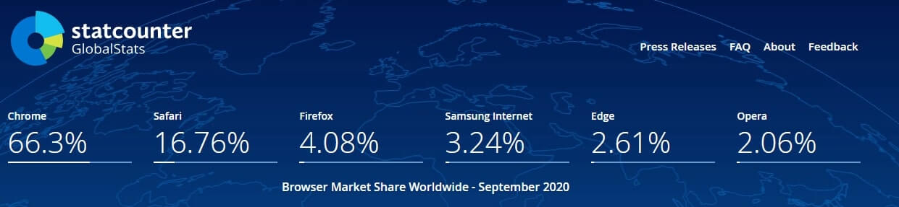

Starting with Chrome 86, Google has decided to remove a feature often leverage by frontend developers: shared resource-cache.
If you are not entirely sure of what it is, let me help you.

Let's take as an example Roboto font referenced from [google font](https://fonts.google.com/specimen/Roboto). Roboto is a very famous font and used on the vast majority of material design websites and applications. Until now you were able to download this font once from the first visited website and then to use the same cached version for every identical HTTP call even if coming from an entirely different domain or application. This feature is called shared resource-cache and is going to be rarer by the day.

Now that Chrome is joining Safari on this change, and that Edge has become Chromium-based, we are going to have the vast majority of browsers don't support it anymore. Only Firefox is holding on for now.

Why are they changing this feature?
The response is simple, privacy and security. This technique is allowing dodgy ways to track the users' history by sampling what is in their cache.
For example, if a website calls [Netflix font](https://assets.nflxext.com/ffe/siteui/fonts/netflix-sans/v3/NetflixSans_W_Rg.woff2) and obtains a fast response, knows that the user has been visiting Netflix lately because the font is cached in the browser. It is possible to trace down every kind of website using this method, including Twitter, Facebook, etc. If the website leaves a footprint, and almost every single one does, can be somewhat traced down, and it is a massive hole in privacy for the final user.

And now what are the effects of this change?
The main effect is more privacy by breaking these tracking techniques. Still, the collateral effect is that from now on, users have to download the same resource for every single website they are visiting instead of being able to use what they have in cache already. This change will result in longer loading times and TTI (Time To Interactive) significantly affecting all developers focussing on website/app performance.
If your KPI revolves around performances, keep an eye on HTTP requests and how to change them based on this change.

Source: [Google Developers](https://developers.google.com/web/updates/2020/10/http-cache-partitioning)
